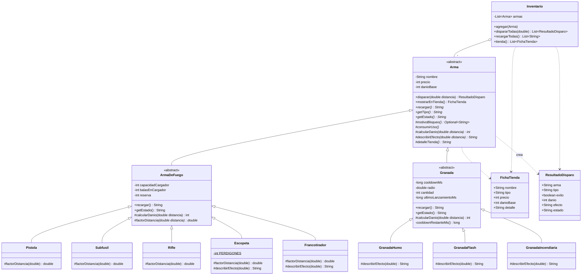

# Taller Git 2026 — Armas de Counter-Strike 2

Servicio HTTP (Spring Boot, API REST) que modela las armas de **Counter-Strike 2** aplicando
herencia, sobreescritura, clases abstractas y ocultamiento de la información.

Materia: Lenguajes de Programación 3 — Taller de Git + POO.
Licencia: Apache License 2.0.

## Entrega

| Qué | Dónde |
|---|---|
| Commit de la entrega | [`532c5f4`](https://github.com/luckvani-gif/vricciardi-tallerlp3-2026/commit/532c5f43c4d1902e3163c2820848d212333ba09f) — *Aplica template de LP3, sobrecargas y documentacion de la rubrica* |
| Código | `src/main/java/py/edu/uc/lp3` |
| Pruebas | `src/test/java/py/edu/uc/lp3/tp2026` (`mvn test`) |
| Bitácora de IA | [`BITACORA.md`](BITACORA.md) |
| Documentación | este `README.md` (organización, endpoints, sobrecarga y sobreescritura) |

## Organización del código

La estructura sigue el **template del TP de LP3** (`domain` → `service` → `rest.controller`,
con `constants` para lo que se repite), de modo que el flujo de una petición se lee de un vistazo:

```
src/main/java/py/edu/uc/lp3
├── Application.java                  @SpringBootApplication + @ComponentScan + @EnableJpaRepositories + @EntityScan
├── constants
│   ├── ApiPaths.java                 rutas de la API (BASE_API + "/armas", "/inventario", ...)
│   └── TiposArma.java                tipos válidos: pistola, subfusil, rifle, ..., granadas
├── domain                            el modelo: no sabe nada de Spring ni de HTTP
│   ├── Arma.java                     clase abstracta, Template Method de disparar()
│   ├── ArmaDeFuego.java              abstracta, generaliza la munición
│   ├── Granada.java                  abstracta, generaliza cantidad y cooldown
│   ├── Pistola, Subfusil, Rifle, Escopeta, Francotirador
│   ├── GranadaHumo, GranadaFlash, GranadaIncendiaria
│   ├── Inventario.java               List<Arma>, dispara todas sin if/instanceof
│   ├── FichaTienda.java              record
│   └── ResultadoDisparo.java         record
├── rest/controller                   la capa web: solo habla con los servicios
│   ├── IndexController.java
│   ├── ArmaController.java
│   ├── InventarioController.java
│   └── ManejadorErrores.java         @RestControllerAdvice: excepción -> 400
└── service                           interfaz de servicio
    ├── ArmaService.java
    ├── InventarioService.java
    └── impl
        ├── ArmaServiceImpl.java      @Service: el único lugar que elige el tipo concreto
        └── InventarioServiceImpl.java @Service: arma el inventario completo

src/test/java/py/edu/uc/lp3/tp2026/
├── Tp2026ApplicationTests.java        la app levanta y el índice responde
└── SobrecargaSobreescrituraTests.java sobrecargas, sobreescrituras e invariantes
```

`ArmaService` e `InventarioService` son las implementaciones del patrón del template
(interface + `service.impl` con `@Service`, inyectado en los controllers con `@Autowired`).
Antes esta lógica vivía en `FabricaArmas`, que quedó reemplazado por `ArmaServiceImpl`.

Dos desviaciones conscientes respecto del template:

- **No hay `repository`.** El dominio no se persiste: `Arma` es abstracta, inmutable y sin
  identificador, así que no puede ser una entidad JPA. Los endpoints son cálculos sobre el modelo.
  Si más adelante hay que guardar armas o inventario, ahí entra `py.edu.uc.lp3.repository`.
- **No hay `py.edu.uc.lp3exceptions`.** El modelo lanza `IllegalArgumentException` y
  `ManejadorErrores` la traduce a 400; las excepciones propias irían en ese paquete.
- `ApiPaths.BASE_API` quedó vacío para no cambiar las URLs públicas del taller; adoptarlo como
  `/api/lp3` es cambiar una sola constante.

## Requisitos y ejecución

- Java 21
- Maven (incluido con `./mvnw`)

```bash
./mvnw spring-boot:run
# luego abrir http://localhost:8080/
```

## Endpoints

| Método | Ruta | Descripción |
|---|---|---|
| GET | `/` | Información del servicio y lista de endpoints |
| GET | `/armas/{tipo}` | Construye un arma con parámetros de la URL y la muestra en la tienda |
| GET | `/armas/{tipo}/disparar?veces=3` | Construye el arma y dispara N veces; sin `distancia` usa 10 m |
| GET | `/inventario` | Tienda con un arma de cada tipo |
| GET | `/inventario/disparar?distancia=5&veces=2` | Cada arma del inventario dispara; muestra el comportamiento de cada una |

Tipos válidos: `pistola`, `subfusil`, `rifle`, `escopeta`, `francotirador`, `humo`, `flash`, `incendiaria`.

Parámetros opcionales de construcción: `nombre`, `precio`, `danio`, `cargador`, `reserva`
(`cargador` y `reserva` van juntos).

```bash
curl "http://localhost:8080/armas/rifle?nombre=M4A4&precio=3100&danio=33"
curl "http://localhost:8080/armas/escopeta/disparar?distancia=4&veces=9"
curl "http://localhost:8080/inventario/disparar?distancia=5&veces=2"
curl "http://localhost:8080/armas/pistola?precio=-5"   # 400: El precio no puede ser negativo
```

## Sobrecarga y sobreescritura

Son los dos mecanismos que pide el enunciado. No son lo mismo y en el código se distinguen así:

- **Sobreescritura**: la clase hija cambia la implementación de un método que ya existía en el padre.
  La firma es idéntica y el método del padre es `abstract`. Ocurre entre clases distintas.
- **Sobrecarga**: en la **misma clase** se repite el nombre con otra lista de argumentos. Conviven
  las dos versiones y el compilador elige según lo que se pase. No hay herencia de por medio.

### Sobreescritura: la pone cada hija

`Arma` declara los métodos abstractos que el padre no puede resolver porque cada tipo de arma responde
distinto: `getTipo()`, `getEstado()`, `recargar()`, `describirEfecto(double)`, `detalleTienda()`,
`motivoBloqueo()`, `consumirUso()` y `calcularDanio(double)`. `ArmaDeFuego` implementa los últimos
dejándolos `final` y agrega el abstracto `factorDistancia(double)`, que es lo único que cambia entre
armas de fuego. Cada hija lo **sobreescribe** con su propia caída de daño:

| Clase | Método sobreescrito | Implementación propia |
|---|---|---|
| `Pistola` | `factorDistancia(double)` | `max(0.5, 1 - d/100)` |
| `Subfusil` | `factorDistancia(double)` | `max(0.3, 1 - d/40)` |
| `Rifle` | `factorDistancia(double)` | `max(0.7, 1 - d/200)` |
| `Escopeta` | `factorDistancia(double)` | perdigones que llegan a la distancia |
| `Francotirador` | `factorDistancia(double)` | `1.0`, no pierde daño |
| `GranadaHumo` / `Flash` / `Incendiaria` | `describirEfecto(double)` | el texto de cada granada |

`Inventario` guarda `List<Arma>` y usa todas igual: el JSON que sale en `/inventario/disparar` es el
de cada clase hija sin un solo `if` por tipo.

### Sobrecarga: mismo nombre, otra lista de argumentos

Se agregó en tres lugares, siempre en la misma clase:

| Clase | Versión simple | Versión sobrecargada |
|---|---|---|
| `Arma` | `disparar()` — usa `DISTANCIA_POR_DEFECTO` (10 m) | `disparar(double distancia)` |
| `Inventario` | `dispararTodas()` | `dispararTodas(double distancia)` |
| `Pistola`, `Subfusil`, `Rifle`, `Escopeta`, `Francotirador` | 3 argumentos: nombre, precio, daño | 5 argumentos: además cargador y reserva |
| `GranadaFlash`, `GranadaHumo` | nombre y precio | nombre, precio y cantidad |
| `GranadaIncendiaria` | nombre, precio y daño | nombre, precio, daño y cantidad |

Las dos versiones de los mensajes no duplican el algoritmo: la sobrecarga **delega** en la otra
(`disparar()` llama a `disparar(DISTANCIA_POR_DEFECTO)`), así el flujo sigue Viviendo en un solo
lugar. En los constructores pasa igual: el simple completa lo que falta y llama al sobrecargado
con `this(...)`, y ese es el que termina llamando a `super(...)`. **Cada firma deja el arma en un
estado legal**, porque la validación vive en los constructores de la jerarquía.

### Se ve en la API

`distancia` ahora es opcional: si no viene en la URL entra la sobrecarga.

```bash
# sobrecarga: dispara sin indicar distancia (10 m)
curl "http://localhost:8080/armas/rifle/disparar?veces=2"

# versión con distancia
curl "http://localhost:8080/armas/rifle/disparar?distancia=60&veces=2"

# las dos variantes en el inventario, una clase hija por fila
curl "http://localhost:8080/inventario/disparar?veces=1"
curl "http://localhost:8080/inventario/disparar?distancia=60&veces=1"
```

Los constructores también se ven desde la URL: `cargador` y `reserva` son opcionales, y si no
mandan ninguno se usa el constructor simple del arma.

```bash
curl "http://localhost:8080/armas/pistola"                              # Glock-18, cargador 20/120
curl "http://localhost:8080/armas/pistola?cargador=5&reserva=10"         # constructor sobrecargado
curl "http://localhost:8080/armas/pistola?cargador=5"                    # 400: van juntos o ninguno
```

Las granadas salen de la URL con su constructor simple: la cantidad de granadas no es un dato que
se mande por la URL, así que la versión sobrecargada se ejercita desde las pruebas.

`SobrecargaSobreescrituraTests` cubre las dos firmas de cada clase y verifica que ninguna deje el
arma en un estado imposible.

## Diagrama de clases



## Decisiones de diseño

- **Ocultamiento:** todos los atributos son `private` (ninguno `protected` ni `public`) y no hay setters.
  Los constructores validan, así que no se puede crear un arma en un estado imposible.
- **Template Method:** `disparar()` es `final` en `Arma`. El flujo (validar → verificar bloqueo → consumir → calcular daño)
  es el mismo para todas; las hijas completan los pasos abstractos.
- **Generalización:** la munición vive una sola vez en `ArmaDeFuego` y el cooldown una sola vez en `Granada`.
  Las armas concretas solo redefinen lo que realmente cambia (caída de daño, efecto).
- **Polimorfismo:** `Inventario` guarda `List<Arma>` y dispara, recarga o muestra en la tienda sin `if` ni `instanceof`.
- **Fábrica:** `ArmaServiceImpl` es el único lugar donde se decide el tipo concreto. Los controllers piden
  un arma por nombre de tipo y reciben siempre el tipo padre `Arma`, nunca una clase concreta.
