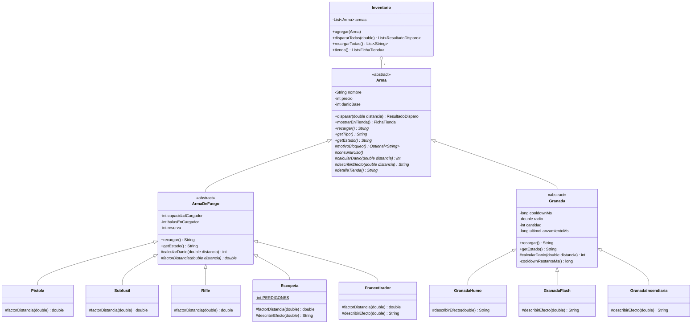

# Taller Git 2026 — Armas de Counter-Strike 2

Servicio HTTP (Spring Boot, API REST) que modela las armas de **Counter-Strike 2** aplicando
herencia, sobreescritura, clases abstractas y ocultamiento de la información.

Materia: Lenguajes de Programación 3 — Taller de Git + POO.
Licencia: Apache License 2.0.

## Requisitos y ejecución

- Java 21
- Maven (incluido con `./mvnw`)

```bash
./mvnw spring-boot:run
# luego abrir http://localhost:8080/
```

## Endpoints

| Método | Ruta | Descripción |
|---|---|---|
| GET | `/` | Información del servicio y lista de endpoints |
| GET | `/armas/{tipo}` | Construye un arma con parámetros de la URL y la muestra en la tienda |
| GET | `/armas/{tipo}/disparar?distancia=10&veces=3` | Construye el arma y dispara N veces |
| GET | `/inventario` | Tienda con un arma de cada tipo |
| GET | `/inventario/disparar?distancia=5&veces=2` | Cada arma del inventario dispara; muestra el comportamiento de cada una |

Tipos válidos: `pistola`, `subfusil`, `rifle`, `escopeta`, `francotirador`, `humo`, `flash`, `incendiaria`.

Parámetros opcionales de construcción: `nombre`, `precio`, `danio`, `cargador`, `reserva`.

```bash
curl "http://localhost:8080/armas/rifle?nombre=M4A4&precio=3100&danio=33"
curl "http://localhost:8080/armas/escopeta/disparar?distancia=4&veces=9"
curl "http://localhost:8080/inventario/disparar?distancia=5&veces=2"
curl "http://localhost:8080/armas/pistola?precio=-5"   # 400: El precio no puede ser negativo
```

## Diagrama de clases



## Decisiones de diseño

- **Ocultamiento:** todos los atributos son `private` (ninguno `protected` ni `public`) y no hay setters.
  Los constructores validan, así que no se puede crear un arma en un estado imposible.
- **Template Method:** `disparar()` es `final` en `Arma`. El flujo (validar → verificar bloqueo → consumir → calcular daño)
  es el mismo para todas; las hijas completan los pasos abstractos.
- **Generalización:** la munición vive una sola vez en `ArmaDeFuego` y el cooldown una sola vez en `Granada`.
  Las armas concretas solo redefinen lo que realmente cambia (caída de daño, efecto).
- **Polimorfismo:** `Inventario` guarda `List<Arma>` y dispara, recarga o muestra en la tienda sin `if` ni `instanceof`.
